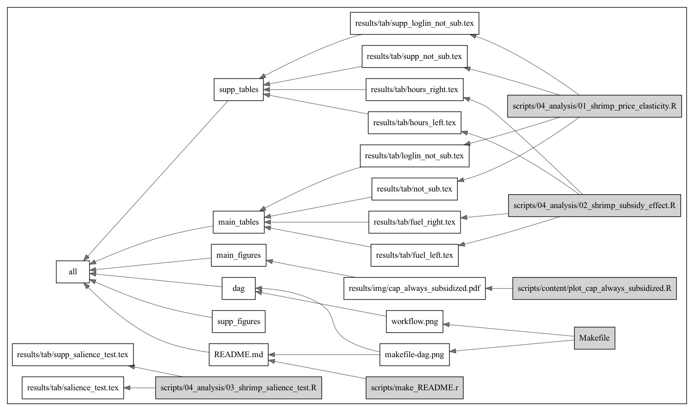

# Repository

The [Make file](Makefile) shows dependencies, also shown below:



## Repository structure 

```
-- data
   |__all_fuel_clean.rds
-- Makefile
-- mexican_subsidies.Rproj
-- README.md
-- renv
-- renv.lock
   |__activate.R
   |__library
      |__R-3.6
      |__R-4.0
   |__settings.dcf
   |__staging
-- scripts
   |__00_setup.R
   |__01_cleaning
      |__01_clean_diesel.R
      |__03_clean_landings.R
   |__02_collection
      |__01_get_fishing_effort.R
   |__03_processing
      |__01_merge_subsidies_effort_and_catches.R
   |__04_analysis
-- word
   |__cuartilla_CausaNatura.docx
   |__cuartilla_CausaNatura.pdf
```

---------

# Data sources

- VMS: Global Fishing Watch
- Permits: Conapesca [link](https://www.conapesca.gob.mx/wb/cona/permisos_de_pesca_comercial) and CausaNatura [link](https://pescandodatos.org/base)
- Landings: CONAPESCA "access to information act"
- Subsidies: PescandoDatos by CausaNatura [link](https://pescandodatos.org/base)

--------- 

<a href="https://orcid.org/0000-0003-1245-589X" target="orcid.widget" rel="noopener noreferrer" style="vertical-align:top;">orcid.org/0000-0003-1245-589X</a>
