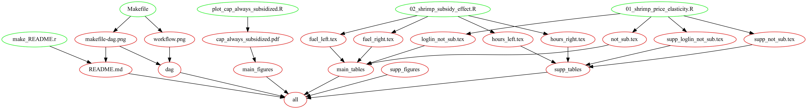

# Carbon whales 


## Dependency graph 

 

## Repository structure 

```
-- data
   |__README.md
-- docs
   |__appfiles
      |__config.jsonp
      |__displays
      |__id
   |__costello_lab_2020_04_09.pdf
   |__costello_lab_2020_04_09.Rmd
   |__gaines_lab_2020_04_16.pdf
   |__gaines_lab_2020_04_16.Rmd
   |__img
      |__Embarcacion-Azteca-1.jpeg
      |__stimulus_package.jpeg
      |__video_intern.jpeg
   |__index.html
   |__lib
      |__htmlwidgets-1.5.1
      |__trelliscopejs_widget-0.3.2
      |__trelliscopejs_widget-binding-0.2.6
   |__MMM_2020_04_12.pdf
   |__MMM_2020_04_12.Rmd
-- json_to_dot.py
-- make_graph.sh
-- make_p_to_json.py
-- Makefile
-- makefile-dag.png
-- mexican_subsidies.Rproj
-- README.md
-- renv
-- renv.lock
   |__activate.R
   |__library
      |__R-3.6
      |__R-4.0
      |__R-4.1
      |__R-4.2
   |__settings.dcf
   |__staging
-- results
   |__img
      |__always_sub_rl.pdf
      |__b_in_time.pdf
      |__cap_always_subsidized.pdf
      |__cons_vs_theory.pdf
      |__cons_vs_theory.png
      |__consumption_densities_plot.pdf
      |__did_setup.pdf
      |__DiD.pdf
      |__disbursements_plot.pdf
      |__fuel_prices_plot.pdf
      |__groups.pdf
      |__groups.png
      |__ihs.pdf
      |__mdl_plot_2019.pdf
      |__mdl_plot_2019.png
      |__N_times_subsidized_histogram.pdf
      |__not_to_law.pdf
      |__not_to_law.png
      |__price_time_series.pdf
      |__reg_by_n_times_sub.pdf
      |__rf_fit.pdf
      |__time_series.pdf
      |__time_series.png
      |__vanilla_demand_curve.pdf
      |__vanilla_demand_curve.png
      |__vanilla_demand_curves.pdf
      |__vanilla_demand_curves.png
      |__vanilla_POM.pdf
      |__vanilla_POM.png
   |__tab
      |__always_subsidized.tex
      |__balance_in_time_table.tex
      |__elasticity_testing_max_price_caps.tex
      |__fuel_all.tex
      |__fuel_left.tex
      |__fuel_right.tex
      |__hours_all.tex
      |__hours_left.tex
      |__hours_right.tex
      |__loglin_not_sub.tex
      |__not_sub.tex
      |__real_cap.tex
      |__salience_test.tex
      |__salience_testing_max_price_caps.tex
      |__salience.tex
      |__semielasticity_testing_max_price_caps.tex
      |__supp_loglin_not_sub.tex
      |__supp_not_sub.tex
      |__supp_salience_test.tex
      |__weight_marginal.tex
-- scripts
   |__00_setup.R
   |__01_cleaning
      |__01_clean_fuel.R
      |__02_clean_vessel_level_subsidy_panel.R
      |__clean_fuel_cre.R
      |__clean_fuel_sie.R
   |__03_processing
      |__01_create_economic_unit_subsidy_panel.R
      |__02_get_annual_effort.R
      |__02_get_monthly_fishing_effort.R
      |__03_create_annual_regression_panel.R
      |__04_create_monthly_regression_panel.R
      |__04_get_gridded_effort.R
      |__05_predict_fuel_subsidy_annual_panel.R
      |__06_build_estimation_panel.R
      |__clean_cpi_data.R
      |__get_nino34.R
   |__04_analysis
      |__01_estimation.R
      |__01_shrimp_price_elasticity.R
      |__02_shrimp_subsidy_effect.R
      |__03_set_up_graph.R
      |__03_shrimp_salience_test.R
      |__04_program_design_graphs.R
      |__did_2014_reduction.R
      |__regressions_by_year.R
      |__robustness_allways_subsidized.R
      |__shrimp_estimates.R
   |__99_exploratory
      |__01_mdl_plot.R
      |__Exploratory_stats.pdf
      |__Exploratory_stats.Rmd
      |__Ito_test.pdf
      |__Ito_test.Rmd
      |__kink_explorer.R
      |__left_right_regs.R
      |__monthly.R
      |__testing_alphas.R
      |__testing_empirics.R
      |__Untitled.R
   |__content
      |__balance_in_time_table.R
      |__consumption_densities_plot.R
      |__disbursements_plot.R
      |__fuel_prices_plot.R
      |__n_obs_region_state.R
      |__plot_cap_always_subsidized.R
   |__make_README.R
   |__report
      |__01_fit_model.R
      |__02_calculate_overfishing.R
      |__03_create_gridded_overfishing.R
      |__04_fishery_level_stats.R
      |__06_program_redesign.R
      |__07_stock_effects.R
-- word
   |__cuartilla_CausaNatura.docx
   |__cuartilla_CausaNatura.pdf
-- workflow.png
```

---------
