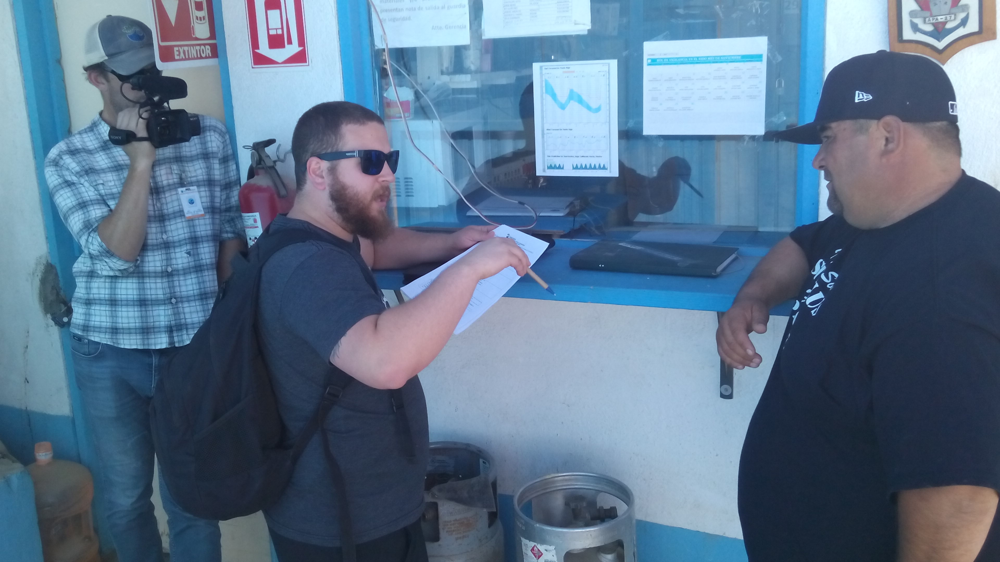
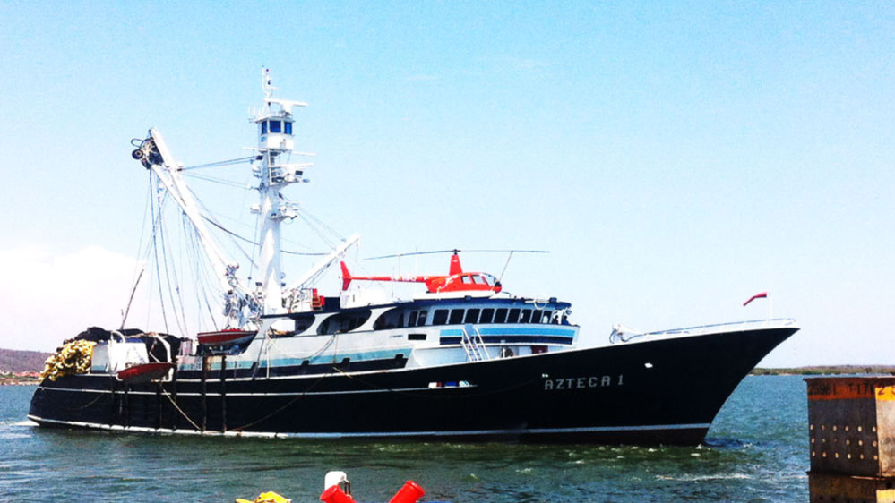

```{r setup, include=FALSE}
knitr::opts_chunk$set(echo = FALSE,
                      warning = FALSE,
                      message = FALSE,
                      fig.width = 3,
                      fig.height = 3,
                      fig.align = "center")
source("../scripts/00_setup.R")
library(here)
library(tidyverse)

theme_set(startR::ggtheme_plot())

# Update theme
theme_update(
  axis.title.y = element_text(hjust = 1),
  axis.title.x = element_text(hjust = 1),
  axis.text.y = element_text(size = 12),
  axis.text.x = element_text(size = 12)
)

# Update geoms
update_geom_defaults(geom = "point",
                     new = list(color = "black",
                                fill = "steelblue",
                                shape = 21,
                                size = 2))

p <- 30 * 1e3
q <- 1e-9
X <- 1e7

c <- 23
c_low <- 23 - 2
beta <- 1.3

L_fun<- function(p, q, X, c, beta){
  ((p*q*X)/(beta * c)) ^ (1 / (beta - 1))
}

fc <- L_fun(p, q, X, c = c, beta)

curve <- tibble(c = 20:30) %>% 
  mutate(L = L_fun(p, q, X, c, beta),
         mean = cumsum(c) / 1:length(c))

```

## Back in the day, during fieldwork



## Back in the day, during fieldwork

{width=75%}

## Some stats

### In the world

- ~ US\$35 billion per year to the fishing industry
- Fuel subsidies account for ~22% of total

### In Mexico

- US\$200 million per year subsidies
- US\$30 million per year on fuel

### Subsidy reforms

- WTO has debated subsidy reforms for almost 20 years now
- SDG 14.6 Seeks to reduce "harmful subsidies"
- Large uncertainty on how big the upsides would be
- High political cost on backtracking them


## Fuel subsidies in fisheries

Demand curve for the average boat

```{r}
dc <- ggplot(data = curve,
             aes(x = L, y = c)) +
  geom_line() +
  labs(x = "Fuel consumption (L)",
       y = "Fuel price ($/L)") +
  scale_y_continuous(labels = "", breaks = NULL) +
  scale_x_continuous(labels = "", breaks = NULL, limits = c(0, NA))
dc
```

## Fuel subsidies in fisheries

```{r}
dc2 <- dc  +
  geom_hline(yintercept = c,
               linetype = "dashed") +
  geom_segment(x = fc, xend = fc,
               y = 0, yend = c,
               linetype = "dashed") +
  geom_point(x = fc, y = c) +
  scale_y_continuous(labels = c("p"), breaks = c(c)) +
  scale_x_continuous(labels = c("L"), breaks = c(fc), limits = c(0, NA))

dc2
```


## Fuel subsidies in fisheries

```{r, fig.cap = "A fuel subsidy induces overfishing"}

fcl <- L_fun(p, q, X, c = c_low, beta)
dc3 <- dc2 +
  geom_hline(yintercept = c_low,
               linetype = "dashed") +
  geom_segment(x = fcl, xend = fcl,
               y = 0, yend = c_low, 
               linetype = "dashed") +
  geom_point(x = fcl, y = c_low, fill = "red") +
  scale_y_continuous(labels = c("p", "p'"), breaks = c(c, c_low)) +
  scale_x_continuous(labels = c("L", "L'"), breaks = c(fc, fcl), limits = c(0, NA))

dc3
```

## Fuel subsidies in Mexico

$$
I_i = (MDL_i \times DPC_i) \times AF
$$

Where:

- $I_i$ is the "Incentive for the acquisition of fuel" for fisher $i$: The amount of fuel (L) that will be subsidized at $p - 2$
- $MDL_i$ is the "Maximum daily liters"
- $DPC_i$ is the "Days per cycle"
- $AF$ is the "Adjustment factor"

With $AF = 1$, $I_i = \mathrm{E}[L]$

## An example

<center>

{width=40%}

</center>

$$
\begin{split}
I_i &= (15455\:[l/day] \times 220\; [days]) \times 0.4 \\
I_i &= (3.4\times10^6 \;[liters]) \times 0.4 \\
I_i &= 1.36\times10^6
\end{split}
$$

- On any given year, Azteca I is expected tro consume 3.4 M liters
- The subsidy makes it such that 1.36 M of that come at a price $p-2$

## Updating the set up

```{r}
dc4 <- dc2 +
  geom_segment(x = -150, xend = 0.5 * fc,
               y = c_low, yend = c_low,
               color = "red") +
  geom_segment(x = 0.5 * fc, xend = 0.5 * fc,
               y = c_low, yend = c,
               color = "red") +
  geom_segment(x = 0.5 * fc, xend = fc * 2,
               y = c, yend = c,
               color = "red") +
  scale_y_continuous(labels = c("p", "p'"), breaks = c(c, c_low)) +
  scale_x_continuous(labels = c("L", "I"), breaks = c(fc, 0.5 * fc), limits = c(0, NA))

dc4
```

## Updating the setup


```{r}

c_mean <- tibble(L = seq(0, 2 * fc, by = 10)) %>% 
  mutate(c = ifelse(L < 0.5 * fc, c_low, c),
         c_mean = cumsum(c) / 1:length(c))

tmp <- expand_grid(L = curve$L, L2 = L_fun(p, q, X, c_mean$c_mean, beta)) %>% 
  mutate(dif = abs(L - L2)) %>% 
  filter(dif == min(dif))

pt <- c_mean %>%
  filter(L < min(tmp$L)) %>%
  filter(c_mean == max(c_mean))

dc4 +
  geom_line(data = c_mean, aes(y = c_mean), linetype = "dotted") +
  geom_point(x = 2475, y = 22.15) +
  geom_segment(y = 22.15, yend = 22.15,
               x = -150, xend = 2475,
               linetype = "dotted") +
  geom_segment(x = 2475, xend = 2475,
               y = 0, yend = 22.15,
               linetype = "dotted") +
  scale_y_continuous(labels = c("p", "p'", "p*"), breaks = c(c, c_low, 22.15)) +
  scale_x_continuous(labels = c("L", "I", "L'", "L*"), breaks = c(fc, 0.5 * fc, fcl, 2475), limits = c(0, NA))
```


## The questions

How do fisher's fuel consumption respond to block pricing caused by fuel subsidies?

### Exciting because we can estimate something useful:

>- Do fishers respond to marginal or average prices? - Interesting insight with implications for micro and fisheries mngmt
>    - If fishers respond to marginal prices, then a subsidy that results in block pricing does not drive overfishing 
>    - If fishers respond to average prices, then:
>       - Even a subsidy that results in block pricing drives overfishing
>       - We would have an estimate the effect of fuel subsidies on fishing effort

# There is room for both

## Two types of vessels

```{r}
curves <- expand_grid(c = 20:30,
                      q = c(0.7, 1.1) * q) %>% 
  mutate(L = L_fun(p, q, X, c, beta))

fc_h <- L_fun(p, 1.1 * q, X, c, beta)

eq_pts <- curves %>% 
  filter(c %in% c(23, 21)) %>% 
  filter(L < 4000)

ggplot(data = curves,
       aes(x = L, y = c, group = q)) +
  geom_line(data = c_mean, aes(y = c_mean), linetype = "dotted") +
  geom_line() +
  geom_line(data = curve, linetype = "dashed") +
  geom_hline(yintercept = c, linetype = "dashed") +
  geom_segment(x = -150, xend = 0.5 * fc,
               y = c_low, yend = c_low,
               color = "red") +
  geom_segment(x = 0.5 * fc, xend = 0.5 * fc,
               y = c_low, yend = c,
               color = "red") +
  geom_segment(x = 0.5 * fc, xend = fc_h * 2,
               y = c, yend = c,
               color = "red") +
  geom_point(data = eq_pts) +
  geom_point(x = 3300, y = 22.35) +
  labs(x = "Fuel consumption (L)",
       y = "Fuel price ($/L)") +
  scale_y_continuous(labels = c("p", "p'", "p*"), breaks = c(c, c_low, 22.15)) +
  scale_x_continuous(labels = c("L", "I"), breaks = c(fc, 0.5 * fc), limits = c(0, NA))
```


## Empirics

Focus only on "bad" fishers

- Consider a dummy variable $D_i = \{0, 1\}$ denoting treatment status of vessel $i$, with 0 indicating no subsidy received and 1 receiving subsidy.
  - So $Y_i(0)$: fuel consumption if the vessel is unsubsidized
  - $Y_i(1)$ if subsidized
  - and we expect $Y_i(1) - Y_i(0) > 0$
- "Bad" fishers are defined based on $Y_i(0)|D_i = 0$ relative to $I_i$


$$
\begin{split}
Y_i &= D_iYi(I) + (1 - D_i)Y_i(0)\\
Y_i &= \alpha + \beta_1D_i + \epsilon_i
\end{split}
$$

## Empirics

Now consider the "good" fishers

Under the same specification:

$$
Y_i = \alpha + \beta_1D_i + \epsilon_i
$$

- $\beta_1 > 0$ would indicate that fishers respond to average prices
- $\beta_1 = 0$ would indicate that fishers respond to marginal prices

## Emprics: All together

- Consider another dummy, $R_i =  \{0, 1\}$, that denotes if a vessel is to the left or right of the kink

$$
\begin{split}
Y_i(0,0)& : \text{Unsubsidized vessels to the left}\\
Y_i(1,0)& : \text{Subsidized vessels to the left}\\
Y_i(0,1)& : \text{Unsubsidized vessels to the right}\\
Y_i(1,1)& : \text{Subsidized vessels to the right}
\end{split}
$$

$$
Y_i = \alpha + \beta_1 R_i + \beta_2 D_i + \beta_3 R_i \times D_i + \epsilon_i
$$

- $\beta_1$ is the causal effect of subsidies on fuel consumption
- $\beta_3$ is the causal effect of a "block pricing" fuel subsidy on consumption


## Figures: Subsidized economic units

```{r}
eu_panel <- tibble(readRDS(here("data", "economic_unit_subsidy_panel.rds"))) %>% 
  select(year, rnpa, subsidy_pesos = subsidy_amount, subsidy_pesos_pv = subsidy_amount_pv) %>% 
  mutate(subsidy_liters = subsidy_pesos / 2,
         subsidy_liters_pv = subsidy_pesos_pv / 2)

eu_panel %>% 
  mutate(treated = subsidy_liters > 0) %>% 
  group_by(year, treated) %>%
  summarize(n = n_distinct(rnpa)) %>% 
  mutate(Status = ifelse(treated, "Subsidized", "Not subsidized")) %>% 
  ggplot(aes(x = year, y = n, fill = Status)) +
  geom_col(color = "black") +
  scale_fill_brewer(palette = "Set1") +
  labs(x = "Year", y = "Number of economic units") +
  theme(legend.position = "top") +
  scale_x_continuous(breaks = seq(2011, 2019, by = 2),
                     labels = seq(2011, 2019, by = 2))
```


## Effort

```{r}
effort_raw <- readRDS(here("data", "vessel_anual_effort.rds"))                    # Fishing effort

effort_raw %>% 
  group_by(year) %>% 
  summarize(n = n_distinct(vessel_rnpa)) %>% 
  ggplot(aes(x = year, y = n)) +
  geom_col(color = "black", fill = "steelblue") +
  scale_fill_brewer(palette = "Set1") +
  labs(x = "Year", y = "Number of vessels") +
  theme(legend.position = "top") +
  scale_x_continuous()
```

## Effort

```{r}
effort_raw %>% 
  group_by(year) %>% 
  summarize(n = n_distinct(eu_rnpa)) %>% 
  ggplot(aes(x = year, y = n)) +
  geom_col(color = "black", fill = "steelblue") +
  scale_fill_brewer(palette = "Set1") +
  labs(x = "Year", y = "Number of economic units") +
  theme(legend.position = "top") +
  scale_x_continuous()
```

## Calculating fuel consumption

$$
C_i = P_i \times SFC_i  \times \left(         L_{max} \times \frac{\frac{v_i}{d_i} + \frac{L_{min}}{L_{max} - L_{min}}}{1 + \frac{L_{min}}{L_{max} - L_{min}}}              \right)
$$
Where:

- $P_i$: Engine power
- $SFC_i$: Specific Fuel Consumption
- $v_i$: Observed speed
- $v_i$: Design speed
- $L_{...}$ Loading factor

## Jackpot?


## Jackpot?


## Not so fast


## Looking closer


## Still, some discontinuities

```{r}

mdl_raw <- read_csv(file.path(project_path, "raw_data", "maximum_daily_liters.csv"))        # Maximum dayl liters for each engine size
mdl <- mdl_raw %>% 
  filter(year == 2019,
         fuel_type == "diesel") %>% 
  select(engine_power_hp, maximum_daily_liters)

expand_grid(potencia = 1:4e3,
            binned_engine_power_hp = sort(unique(mdl$engine_power_hp))) %>% 
  drop_na() %>% 
  filter(binned_engine_power_hp <= potencia) %>% 
  mutate(dif = abs(potencia - binned_engine_power_hp)) %>% 
  group_by(potencia) %>% 
  top_n(n = -1, dif) %>% 
  select(-dif) %>% 
  ungroup() %>% 
  left_join(mdl, by = c("binned_engine_power_hp" = "engine_power_hp")) %>% 
  ggplot(aes(x = potencia, y = binned_engine_power_hp, color = maximum_daily_liters)) +
  geom_step(size = 1) +
  geom_segment(x = 2000, xend = 2000,
               y = 0, yend = 1350,
               color = "black",
               linetype = "dashed") +
  geom_segment(x = -150, xend = 2000,
               y = 1350, yend = 1350,
               color = "black",
               linetype = "dashed") +
  guides(color = guide_colorbar(title = "Maximum daily liters",
                               frame.colour = "black",
                               ticks.colour = "black")) +
  scale_color_viridis_c() +
  theme(legend.justification = c(0, 1),
        legend.position = c(0, 1)) +
  labs(x = "Vessel's engine size (HP)", y = "Discrete engine bin (HP)") +
  coord_equal()
```


